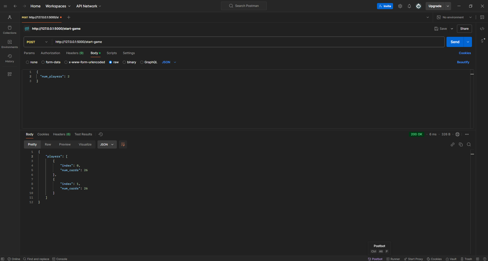
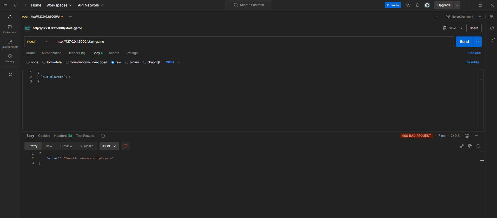
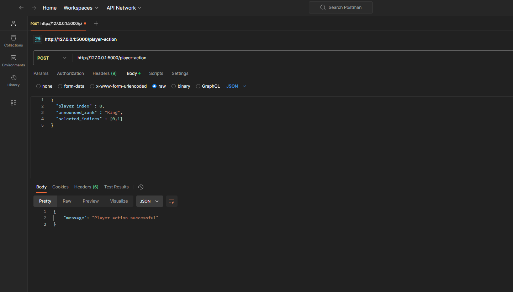
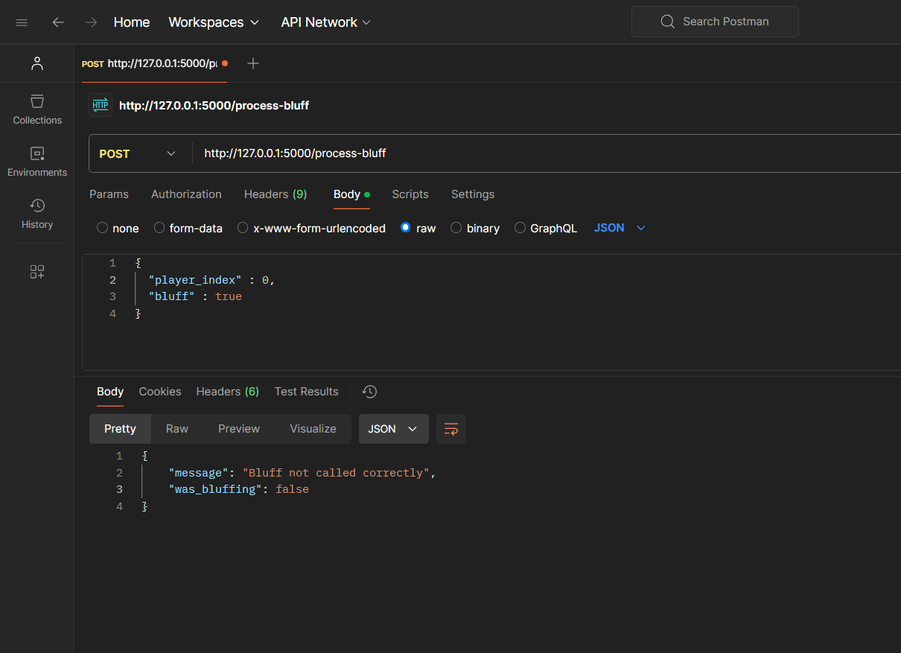
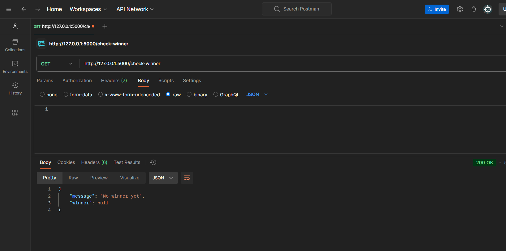

# Test Case Validation for Bluff Game API

This document outlines the validation results for the acceptance test cases of the Bluff game API.

---

## Test Case 1: Start Game with Valid Number of Players
- **What was tested?**  
  Sending a `POST` request to `/start-game` with `num_players: 2`.
- **What was expected?**  
  Response status `200 OK` and a JSON response showing two players with 26 cards each.
- **What was observed?**  
  Response matched the expected result. Each player received 26 cards.
- **Status:** **Passed**

---

## Test Case 2: Start Game with Invalid Number of Players
- **What was tested?**  
  Sending a `POST` request to `/start-game` with `num_players: 1`.
- **What was expected?**  
  Response status `400 Bad Request` with an error message `"Invalid number of players"`.
- **What was observed?**  
  Response matched the expected result, including the error message.
- **Status:** **Passed**

---

## Test Case 3: Player Makes a Valid Action
- **What was tested?**  
  Sending a `POST` request to `/player-action` with valid parameters for Player 0.
- **What was expected?**  
  Response status `200 OK` with a message `"Player action successful"`.
- **What was observed?**  
  Response matched the expected result.
- **Status:** **Passed**

---

## Test Case 4: Call Bluff
- **What was tested?**  
  Sending a `POST` request to `/process-bluff` with valid parameters for a bluff call.
- **What was expected?**  
  Response indicating whether the bluff was successful or not.
- **What was observed?**  
  Response indicated `"Bluff not called correctly"` and `"was_bluffing": false`, which aligns with the expected behavior.
- **Status:** **Passed**

---

## Test Case 5: Check Winner
- **What was tested?**  
  Sending a `GET` request to `/check-winner`.
- **What was expected?**  
  Response status `200 OK` with `"winner": null` if no winner is determined yet.
- **What was observed?**  
  Response matched the expected result, confirming no winner yet.
- **Status:** **Passed**

---

**Summary:**  
All test cases passed successfully, and the system behaves as expected for the provided scenarios.

